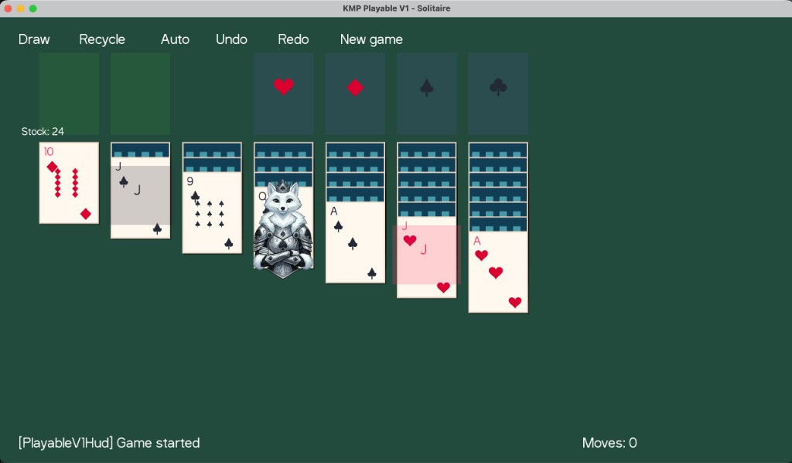

# Kotlin Multiplatform Solitaire

[](https://github.com/annaharri89/KMPCardGames/actions/workflows/ci.yml)

Solitaire and FreeCell (in progress) on **Kotlin Multiplatform**: one shared gameplay core (`:shared`) and a **KorGE** client (`:clients:korge`) for desktop, web, Android, and iOS. Rules, state, and pure layout/hit geometry stay out of the engine; the client maps shared types to KorGE views and input.

| | |
| --- | --- |
| **Live demo** | [harrisonsoftware.dev/solitaire](https://harrisonsoftware.dev/solitaire) |
| **Walkthrough** | [Demo video](https://annaharri89.github.io/images/external/KMPSolitaireDemo.mov) |



## Tech stack

| | Version / notes |
| --- | --- |
| Kotlin | 2.0.21 |
| Gradle | 8.10.2 (wrapper) |
| Android Gradle Plugin | 8.6.1 |
| KorGE (plugin + library) | 6.0.0 |
| CI JDK | Temurin 21 |

**Modules:** `:shared` (KMP library, no KorGE) · `:clients:korge` (KorGE app, depends on `:shared`).

## Prerequisites

- **JDK 21** (CI uses Eclipse Temurin 21).
- **Android:** Android SDK, platform tools (`adb`), and a device or emulator for `runAndroidDebug` / install tasks.
- **iOS Simulator:** macOS with **Xcode** (Apple toolchains for Kotlin/Native).
- **Web dev:** a browser; optional **Chrome/Chromium** for `jsTest` (see [Browser tests](#browser-tests)).

Open the repo in **IntelliJ IDEA** or **Android Studio**, let Gradle sync, then use the tasks below from the IDE terminal or a shell at the repo root.

## Getting started

From the repository root:

| Target | Command |
| --- | --- |
| Desktop (JVM) | `./gradlew :clients:korge:jvmRun` |
| Web (dev server) | `./gradlew :clients:korge:jsBrowserDevelopmentRun` |
| Android — run | `./gradlew :clients:korge:runAndroidDebug` |
| Android — install | `./gradlew :clients:korge:installAndroidDebug` |
| Android — package | `./gradlew :clients:korge:packageAndroidDebug` |
| iOS Simulator — run (detached) | `./gradlew :clients:korge:runIosSimulatorDebugDetached` |
| iOS Simulator — install | `./gradlew :clients:korge:installIosSimulatorDebug` |
| iOS Simulator — package | `./gradlew :clients:korge:packageIosSimulatorDebug` |

`runAndroidDebug` expects a device or emulator already visible to `adb`. For emulator-focused flows, KorGE also exposes tasks such as `androidEmulatorStart`, `runAndroidEmulatorDebug`, and `installAndroidEmulatorDebug` on `:clients:korge`.

For iOS, `runIosSimulatorDebug` in this repo is wired to depend on `runIosSimulatorDebugDetached` and skip the attach-to-console exec; prefer **`runIosSimulatorDebugDetached`** for local “install and launch on booted simulator.”

## Project structure

Gradle project name: **`kmpExample`**.

```
:shared                          # KMP library — domain + presentation (no KorGE)
├── domain/                      # Rules, models, session, reducer, render projection
└── presentation/                # Intents, store, pure geometry (hit rects, anchors)

:clients:korge                   # KorGE application
└── src/commonMain/kotlin/ui/   # Scenes, assets, input, board renderer
```

**Dependency direction:** `:clients:korge` → `:shared` (`dependencyProject(":shared")` in `clients/korge/build.gradle.kts`).

**`:shared` targets** (from `shared/build.gradle.kts`): Android, desktop JVM (`jvm("desktop")`), JS browser, iOS (`iosX64`, `iosArm64`, `iosSimulatorArm64`), tvOS (`tvosArm64`, `tvosX64`, `tvosSimulatorArm64`). There is **no** KorGE tvOS app in this repo; tvOS is compiled for `:shared` only.

### Where to look first

1. [`shared/src/commonMain/kotlin/domain/`](shared/src/commonMain/kotlin/domain/) — rule logic and state transitions  
2. [`shared/src/commonMain/kotlin/presentation/solitaire/`](shared/src/commonMain/kotlin/presentation/solitaire/) — intent / store mapping  
3. [`shared/src/commonMain/kotlin/presentation/solitaire/geometry/`](shared/src/commonMain/kotlin/presentation/solitaire/geometry/) — pure hit / layout math  
4. [`clients/korge/src/commonMain/kotlin/ui/`](clients/korge/src/commonMain/kotlin/ui/) — KorGE UI and input wiring  

Domain and presentation live as **packages inside `:shared`**, not as separate Gradle modules.

## Architecture

- **Shared core:** One implementation of rules and deterministic updates for every client that links `:shared`. Tests in `shared/src/commonTest` exercise the same paths across targets.
- **Client:** KorGE stays in `:clients:korge`; gameplay stays engine-agnostic. Geometry and hit-testing remain **pure Kotlin in `:shared`** so tests stay simple; the renderer maps shared geometry to KorGE views.
- **Boundaries:** No `korlibs.*` (or other KorGE packages) under `shared/src`. CI scripts enforce that and the client↔shared API boundary (see [CI](#continuous-integration)).

## Code-sharing snapshot

Snapshot measured **2026-04-15** (non-blank `.kt` lines; `commonTest` excluded from app Kotlin totals). Numbers drift as the repo grows.

- **`commonMain` app Kotlin** (`:shared` + `:clients:korge`): ~**98%** of measured app Kotlin; **105** lines in platform-specific `.kt` outside `commonMain` for those trees.  
- **Shared tests:** `shared/src/commonTest/kotlin` — **11** files / **32** `@Test` functions.  

## Testing

- **Shared unit tests (CI):** `./gradlew :shared:desktopTest :shared:testDebugUnitTest` — JVM desktop plus Android unit tests over `commonTest`.
- **Browser (`jsTest`):** not run in CI; needs `CHROME_BIN` pointing at Chrome or Chromium.

### Browser tests

`jsTest` needs a Chrome/Chromium binary path.

**macOS (Homebrew Chrome):**

```bash
brew install --cask google-chrome
export CHROME_BIN="/Applications/Google Chrome.app/Contents/MacOS/Google Chrome"
./gradlew :clients:korge:jsTest
```

Persist `CHROME_BIN` in `~/.zshrc` if you run browser tests often.

## Continuous integration

Workflow: [`.github/workflows/ci.yml`](.github/workflows/ci.yml) on every push and PR.

- **Java:** Temurin 21  
- **Shared:** `:shared:desktopTest`, `:shared:testDebugUnitTest`  
- **Guards:** `./scripts/check-shared-no-korlibs.sh`, `./scripts/check-client-boundary.sh`  
- **Smoke builds:** `:clients:korge:compileKotlinJvm`, `jsBrowserDevelopmentWebpack`, `compileKotlinIosSimulatorArm64` (macOS job), `assembleDebug` with Android SDK (Linux job)  

`:clients:korge:jsTest` is local-only until a headless browser is wired in CI.

## Roadmap

- **FreeCell** gameplay: work in progress  

## License

[Apache License 2.0](LICENSE)
